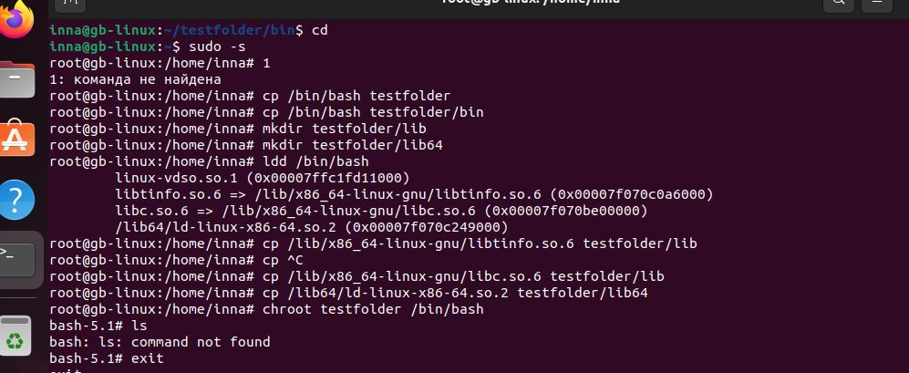
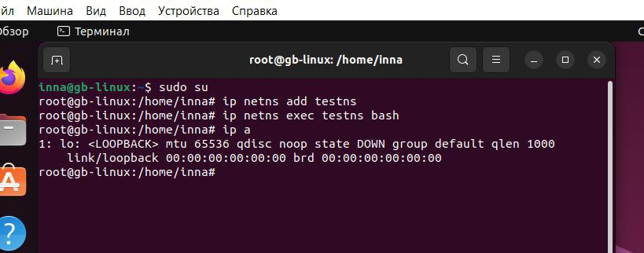
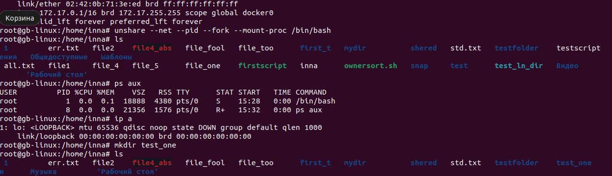

# Создание пространства имен.
* Создаем новую директорию и переносим в нее корень
* В новую оболочку переносим системные файлы
* Копируем библиотеки для отдельного пространства

# Изоляция сети
*Пространство наделяем оболочкой

# Изоляция сети и процессов
* unshare --net --pid --fork --mount-proc /bin/bash
* unshare - утилита разграничивает пространства имен
* --net - ограничивает сетевое пространство имен
* --pid - изолирует дерево процессов
* --fork - изолирует память
* --mount-proc -разграничивает процессы
* bin/bash - запускает процессы
